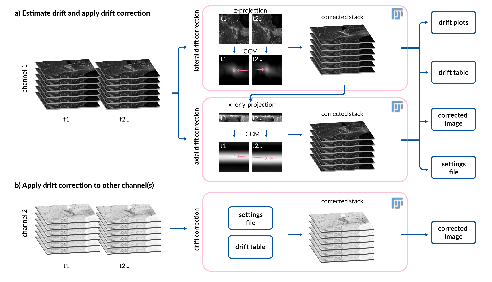

# Fast4DReg

# Overview

Fast4DReg is a Fiji macro for drift correction in 3D video and is able to correct drift in all x-, y- and/or z-directions. Fast4DReg creates intensity projections along both axes and estimates their drift using the NanoJ-Core [(Laine et al., 2019)](https://iopscience.iop.org/article/10.1088/1361-6463/ab0261) cross-correlation based drift correction, and then translates the 3D video frame by frame (Figure 1). Additionally, Fast4DReg can be used for aligning multichannel 3D images which is particularly useful for instruments that suffer from a misalignment of channels. 

Fast4DReg consists of four scripts.

### Fast4DReg scripts

- **time_estimate+apply:** This script estimated drift in a 3D video and applies the correction to the same dataset. The script will also output a *settings.csv* file with relevant script parameters and file paths. This file can be use to correct a similar drift in another dataset, for example another channel. 

- **time_apply:** This script will apply a drift correction from *settings.csv* a to another image.

- **channel_estimate+apply:** This script estimates misalignement of channels in a 3D dataset and applies the correction to the same dataset. The script will also output a *settings.csv* file with relevant script parameters and file paths. This file can be use to correct a similar drift in another dataset. 

- **channel_apply:** This script will apply a drift correction from *settings.csv* a to another image.

### Drift correction workflow
**xy-correction**
1. First Fast4DReg creates intensity lateral projections (average or maximum) at each time point to create 2D videos. 
2. Second, Fast4DReg uses the NanoJ-Core 2D drift correction algorithm to estimate the linear x-y drift between two images by calculating their cross-correlation matrix (CCM). The location of the peak intensity in the CCM determines the linear shift between the two images. Depending on the data, either the first frame or the previous frame of the raw data can be set as the reference frame. 
3. Once the drift is estimated, the dataset can be directly corrected frame by frame according to the amount of estimated drift. 

**z-correction**

4. Fast4DReg creates lateral intensity projections (average or maximum) at each time point to create 2D videos along the y- or z-axis. 
5. Fast4DReg uses the NanoJ-Core as in step 2.
6. Once the z-drift is estimated, the dataset can be directly corrected frame by frame according to the amount of estimated drift.

If using multichannel images, the channels need to be split. The drift will be estimated according to the channel that has more stable structures (for example endothelium instead of migrating cancer cells). The drift correction can then be applied to the second (or more) channels.

***Figure 1: Fast4DReg pipeline.*** *Fast4DReg corrects for drift in x-y direction by first creating intensity projections to create 2D videos. Then it estimates the linear x-y drift between two images by calculating their cross-correlation matrix and applying the correction to the stack. To correct the drift in the z-direction Fast4DReg creates frontal intensity and corrects the drift as described above. Lateral and axial drift corrections can also be used independently. Fast4DReg outputs a folder containing the corrected images, drift plots, a drift table and a settings file that can be applied to correct another image with the same settings.*

# Installation

### Fast4DReg

Fast4DReg is easy to istall by enabling the Fast4DReg update site:
- Open ImageJ 
- Navigate to *Help -> Update -> Manage update sites*
- Select FastDReg

- When selected select *Close* and *Apply changes*. 
- Restart Fiji.

### Dependencies

Fast4DReg requires the **NanoJ-Core** plugin and **Bioformats**, which can both be installed through the Fiji update site: 
- Open ImageJ 
- Navigate to *Help -> Update -> Manage update sites*
- Select NanoJ-Core and Bio-Formats

- When selected select *Close* and *Apply changes*. 
- Restart Fiji.

# Step-by-step walkthrough

### Estimate and apply drift

**Before starting**

Prepare your image to have one channel. If you have multiple channels they can all be in the same folder as separate files.

**Running the script**
1. Open the "estimate-drift" script and click run. The user interface opens.

*Figure 2: Estimate and apply user interface*

2. In the user interface
- **Experiment number:** Will be used for the output folder identifier.
- **Select the path to the file to be corrected:** navigate to your image to be corrected here.
- **xy-drift correction:** if you want to correct for xy-drift, tick the xy-drift correction box.
- **Projection type:** Select the projection type used for xy-drift estimation (maximum or average intensity).
- **Time averaging:** This sets the number of frames to average together to make coarser time points on which the
cross-correlation analysis will be run to calculate drift. Setting this value to 1 will calculate
straight frame-to-frame cross-correlations and while this should capture drift very accurately, it
will also be very susceptible to noise. Conversely, setting this value high will average out noise
but will also give a lower sample of the drift (which is then interpolated).
- **Maximum expected drift:** This refers to the maximum expected drift between the first frame of the dataset and the last
frame of the dataset in units of pixels. Setting this to 0 will allow the algorithm to automatically
determine the drift without any limitations. It is only really worth changing this value from 0 if
running the algorithm gives incorrect results with large jumps in estimated drift.
- **Reference frame:** If this is set to ‘first frame (default, better for fixed)’ then every averaged group of frames will be
compared to the first average group of frames to calculate drift. If this is set to ‘previous frame
(better for live)’ then every averaged group of frames will be compared to the previous averaged
group of frames. For static samples, it is best to
compare to the first frame, and for live samples where there may be slow scale drift overlaying
the faster scale sample motion, it is better to compare to the previous frame.
- **Crop output:** Crop output will crop out the black frame created by the image moving. This will be performed on default if continued to z-correction.
- **z-drift correction:** If you want to correct for z-drift, tick the z-drift correction box.
- **Reslice mode:** Reslice mode lets you decide if you want to create the projection along the x-axis (top) or y-axis (left).
- **Projection type:** Select the projection type used for z-drift estimation (maximum or average intensity) 
- **Extend stack to fit:** Extend stack to fit will create extra slices to the stack to ensure that the whole stack is saved.
- **Save RAM:** If ticked the z-corrected image is built frame by frame instead of building the image in one go. This saves RAM but approximately doubles the time for processing.
  
3. Click ok. The script will run.
4. When the script has completed the process, you will have the following files in a new folder:
       - corrected images
       - drift plots
       - drift tables
       - a settings file, you can use to run the script on another image with identical parameters. 
   
   The folder will have an unique identifyer: *fileName + date + experiment number*. 
   If you plan to apply the correction to another channel, make sure not to move these files to another folder.
  
### Apply drift

1. Open the "apply" script and click run. The user interface opens.  

*Figure 3: Apply user interface*

- **Select the path to the file to be corrected:** Navigate to your image to be corrected here.
- **Select the settings file (csv.):**. Navigate to your settings file (called settings.csv).

2. Click ok. The corrected image will be saved to the same folder with the settings file.

Done!

# Known issues

**Fiji crashing without notice**

Windows might not have OpenCL installed. If you experience Fiji crashing without notice, [install the OpenCL through the Microsoft store library.](https://www.microsoft.com/en-us/p/opencl-and-opengl-compatibility-pack/9nqpsl29bfff?activetab=pivot:overviewtab)

**Importance of file locations**

Make sure not to move the drift table from the results folder as the path to the drift table is hardcoded to the settings.csv file. 

**Result images are black**

Try disabling time averaging (1).

# Contributors

* [Joanna Pylvänäinen](https://twitter.com/JwPylvanainen)
* [Romain F. Laine](https://twitter.com/LaineBioImaging)
* [Ricardo Henriques](https://twitter.com/HenriquesLab)
* [Guillaume Jacquemet](https://twitter.com/guijacquemet)

# When using this script, please cite the NanoJ paper

Laine, R. F., Tosheva, K. L., Gustafsson, N., Gray, R., Almada, P., Albrecht, D., Risa, G. T., Hurtig, F., Lindås, A. C., Baum, B., Mercer, J., Leterrier, C., Pereira, P. M., Culley, S., & Henriques, R. (2019). NanoJ: a high-performance open-source super-resolution microscopy toolbox. Journal of physics D: Applied physics, 52(16), 163001. https://doi.org/10.1088/1361-6463/ab0261

# Change log
 **220222 Version 1.0 (pre-print)**
 
All four scripts have been tested and work well. Ready for pre-print.

